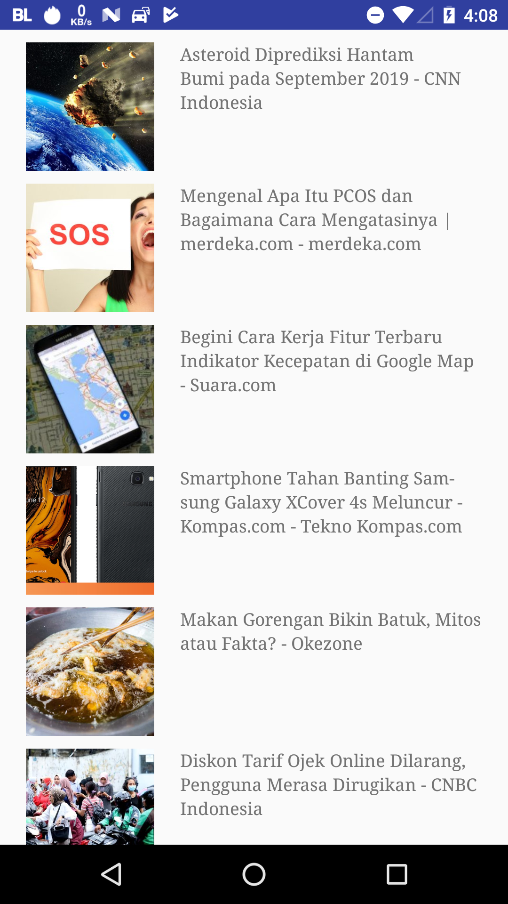

# Base Android Project with Kotlin
MVVM Base Android Kotlin Project

## Tech Stack
- Kotlin
- AndroidX
- Coroutine
- Retrofit / OkHttp
- Gson
- Groupie as Recyclerview lib
- sdp ssp
- Hilt as Dependency Injection lib
- Picasso as Image loader

## Extra
- `./gradlew detekt` static analysis with detekt
- `./gradlew testDebugUnitTestCoverage` for codeCoverage
- `./gradlew check` for running all

## How to use
- Register and create your api key here https://newsapi.org/register
- Copy secrets.properties.example to secrets.properties and put ur API KEY